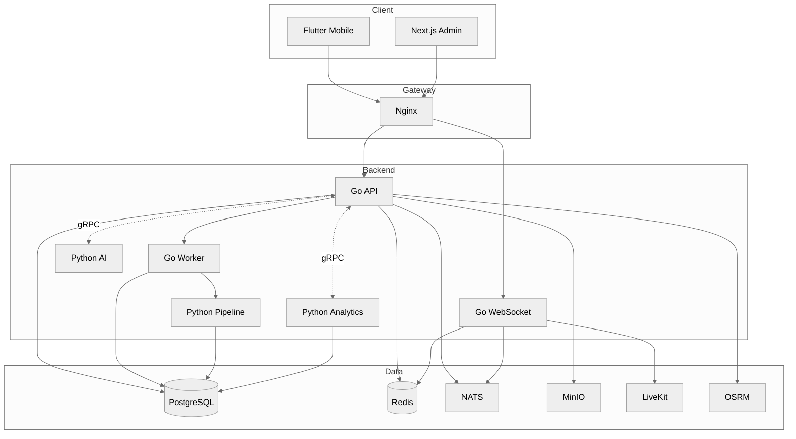

<!-- ═══════════════════════════════════════════════════════════════════════
     GoRoad — README.md
     ═══════════════════════════════════════════════════════════════════════ -->

<div align="center">

<!-- ░░░░░░░░░░░░░░░░░░ ANIMATED HEADER WAVE ░░░░░░░░░░░░░░░░░░ -->


<!-- ░░░░░░░░░░░░░░░░░░ TYPING ANIMATION ░░░░░░░░░░░░░░░░░░ -->

<a href="#">
  
</a>

<br/>

<!-- ░░░░░░░░░░░░░░░░░░ STATUS BADGES ░░░░░░░░░░░░░░░░░░ -->


&nbsp;

&nbsp;

&nbsp;


<br/><br/>

<!-- ░░░░░░░░░░░░░░░░░░ TECH STACK ICONS ░░░░░░░░░░░░░░░░░░ -->

<p>
  
</p>
<p>
  
</p>

<br/>

<!-- ░░░░░░░░░░░░░░░░░░ ADDITIONAL TECH BADGES ░░░░░░░░░░░░░░░░░░ -->

<p>
  
  &nbsp;
  
  &nbsp;
  
  &nbsp;
  
  &nbsp;
  
  &nbsp;
  
  &nbsp;
  
  &nbsp;
  
  &nbsp;
  
  &nbsp;
  
</p>

</div>

<br/>

<!-- ░░░░░░░░░░░░░░░░░░ ANIMATED SECTION DIVIDER ░░░░░░░░░░░░░░░░░░ -->


## About

iseng iseng bikin pas lagi bosen, eh malah gede sendiri sampe segini. **GoRoad** adalah platform buat komunitas touring motor — biar kalo touring bareng ga ilang ilangan, urusan bensin & expense ke-track, dan yang pasti biar makin seru.

<br/>

## Fitur

<div align="center">
<p>
  
  &nbsp;
  
  &nbsp;
  
  &nbsp;
  
  &nbsp;
  
  &nbsp;
  
  &nbsp;
  
  &nbsp;
  
  &nbsp;
  
  &nbsp;
  
  &nbsp;
  
  &nbsp;
  
  &nbsp;
  
</p>
</div>

<details>
<summary><b>detail semua fitur</b></summary>
<br/>

| Fitur | Deskripsi |
|-------|-----------|
| **Room Touring** | bikin room, ngajak temen, atur formasi berangkat |
| **Chat Realtime** | ngobrol pas touring — pake websocket, realtime |
| **Tracking Live** | tau posisi rombongan biar ga ada yang ketinggalan |
| **Rute** | bikin rute + waypoint + export gpx + osrm integration |
| **SOS & Emergency** | panic button kalo ada apa apa di jalan |
| **Voting** | mutusin tempat makan, istirahat, atau tujuan bareng bareng |
| **Fuel & Expense** | catat bensin & pengeluaran, split bill otomatis |
| **Checklist** | biar ga lupa bawa jas hujan, tools, atau dokumen |
| **Social Feed** | pamer foto touring, likes & comments |
| **Leaderboard & Badge** | kompetisi jarak tempuh & pencapaian |
| **AI Chat** | pake gemini — nanya rute, packing list, saran safety |
| **PTT Voice** | push to talk pake livekit, biar ga ribet ngetik |
| **Admin Dashboard** | pantau semua aktivitas dari satu tempat |

</details>

<br/>

<!-- ░░░░░░░░░░░░░░░░░░ ANIMATED SECTION DIVIDER ░░░░░░░░░░░░░░░░░░ -->


## Arsitektur



<br/>

## Tech Stack

<div align="center">

<table>
<tr>
<td align="center" width="50%">

<h4>Client</h4>

<br/>


<br/><br/>

**Flutter Mobile** — Android + iOS
<br/>
**Next.js** — Admin Dashboard

<br/><br/>

</td>
<td align="center" width="50%">

<h4>Backend</h4>

<br/>


<br/><br/>

**Go** — API, WebSocket, Worker
<br/>
**Python** — AI (Gemini), Analytics, Pipeline

<br/><br/>

</td>
</tr>
<tr>
<td align="center" width="50%">

<h4>Data & Messaging</h4>

<br/>


<br/><br/>


&nbsp;

&nbsp;

&nbsp;


<br/><br/>

**PostgreSQL** — PostGIS + TimescaleDB
<br/>
**Redis** — Cache, Session, Rate Limit
<br/>
**NATS** — Event-Driven Messaging

<br/><br/>

</td>
<td align="center" width="50%">

<h4>DevOps & Monitoring</h4>

<br/>


<br/><br/>


&nbsp;


<br/><br/>

**Docker** — Containerization
<br/>
**Nginx** — SSL, WS Proxy, Rate Limit

<br/><br/>

</td>
</tr>
</table>

</div>

<details>
<summary><b>detail versi</b></summary>
<br/>

| Komponen | Versi |
|----------|-------|
| Go | 1.23 |
| Python | 3.12 |
| Flutter | 3.38.10 |
| Dart | 3.10.9 |
| Next.js | 15.x |
| PostgreSQL | 16 + PostGIS 3.4 + TimescaleDB 2.17 |
| Redis | 7 (alpine) |
| NATS | 2.10 (JetStream) |
| LiveKit | 1.6 |
| OSRM | 5.27 |
| Celery | 5.4 (Redis broker) |
| gRPC | protobuf (Go ↔ Python) |

</details>

<br/>

<!-- ░░░░░░░░░░░░░░░░░░ ANIMATED SECTION DIVIDER ░░░░░░░░░░░░░░░░░░ -->


## Cara Jalanin

<details open>
<summary><b>Docker (semua service)</b></summary>
<br/>

paling gampang tinggal jalanin ini:

```bash
cp .env.example .env   # lalu isi api key
docker compose up --build -d
```

</details>

<details>
<summary><b>Manual (development)</b></summary>
<br/>

> prerequisite: postgres, redis, nats, minio harus jalan duluan.

<br/>

**Go Backend**

```bash
cd go-road-backend

go run ./cmd/api/main.go       # REST API — port 8080
go run ./cmd/ws/main.go        # WebSocket — port 8081
go run ./cmd/worker/main.go    # Background Worker
```

**Python Services**

```bash
# AI Service (Gemini) — port 8001
cd py-ai-service
pip install -r requirements.txt
uvicorn app.main:app --reload --port 8001

# Analytics Service — port 8002
cd py-analytics-service
pip install -r requirements.txt
uvicorn app.main:app --reload --port 8002

# Data Pipeline (Celery Workers)
cd py-data-pipeline
pip install -r requirements.txt
celery -A app.tasks.celery_app worker --loglevel=info
celery -A app.tasks.celery_app beat --loglevel=info
```

**Flutter**

```bash
cd go_road_app_flutter
flutter pub get
flutter run
```

**Admin Dashboard**

```bash
cd go-road-admin
npm install
npm run dev
```

</details>

<br/>

## Environment

copy `.env.example` jadi `.env` terus isi:

| Variable | Deskripsi |
|----------|-----------|
| `JWT_SECRET` | secret jwt token |
| `GEMINI_API_KEY` | ai chat pake gemini |
| `OPENWEATHER_API_KEY` | data cuaca realtime |
| `LIVEKIT_API_KEY` | voice chat |
| `LIVEKIT_API_SECRET` | secret voice chat |
| `SENTRY_DSN` | error tracking |

<br/>

## Struktur Folder

```
go-road/
├── go-road-backend/              Go — API, WebSocket, Worker
│   ├── cmd/
│   │   ├── api/main.go
│   │   ├── ws/main.go
│   │   └── worker/main.go
│   └── internal/
│       ├── config/
│       ├── domain/               21 domain entities
│       ├── dto/                  request & response
│       ├── handler/              Fiber handlers
│       ├── middleware/           auth, cors, logger, rate limit
│       ├── repository/           PostgreSQL + Redis
│       ├── service/              business logic
│       ├── ws/                   WebSocket hub & handlers
│       ├── event/                NATS pub/sub
│       └── worker/               background tasks
├── go_road_app_flutter/          Flutter mobile app
├── go-road-admin/                Next.js admin dashboard
├── py-ai-service/                Python — AI (Gemini)
├── py-analytics-service/         Python — Analytics
├── py-data-pipeline/             Python — Celery workers
├── py-shared/                    shared Python utils
├── proto/                        gRPC protobuf definitions
├── migrations/                   SQL migrations (11 files)
├── docker/                       Dockerfiles + nginx.conf
├── monitoring/                   Prometheus, Grafana, Loki, Sentry
├── loadtest/                     k6 load test
├── docker-compose.yml
├── docker-compose.dev.yml
└── .env.example
```

<br/>

## Testing

<details>
<summary><b>jalanin semua test</b></summary>
<br/>

```bash
# Go
cd go-road-backend && go test ./... -cover

# Python AI
cd py-ai-service && pytest -v --cov=app

# Python Analytics
cd py-analytics-service && pytest -v --cov=app

# Flutter
cd go_road_app_flutter && flutter test

# Admin
cd go-road-admin && npm test
```

</details>

<br/>

## Kontribusi

kalo nemu bug atau punya ide, tinggal buka issue atau pull request. siapa tau bisa jadi tandingan waze buat motoran.

<br/>

<!-- ░░░░░░░░░░░░░░░░░░ ANIMATED FOOTER WAVE ░░░░░░░░░░░░░░░░░░ -->


<div align="center">
  <br/>
  <sub><i>dibikin pake hati, seneng tipis tipis, lelah tebal tebal.</i></sub>
  <br/><br/>
</div>
